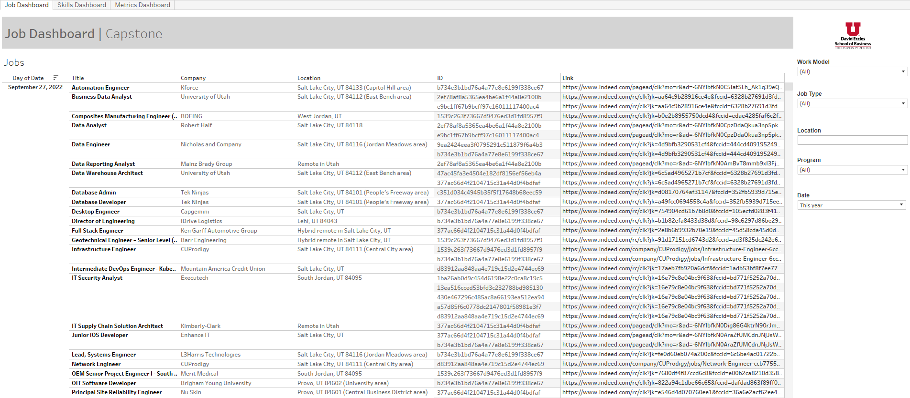
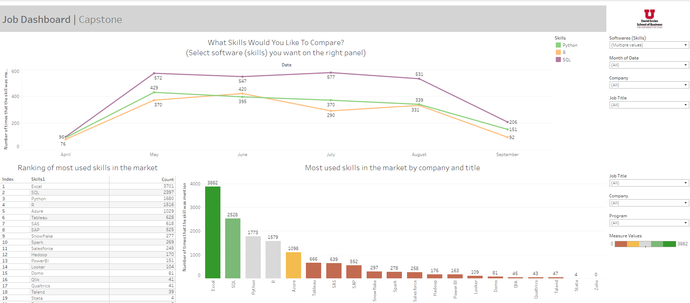
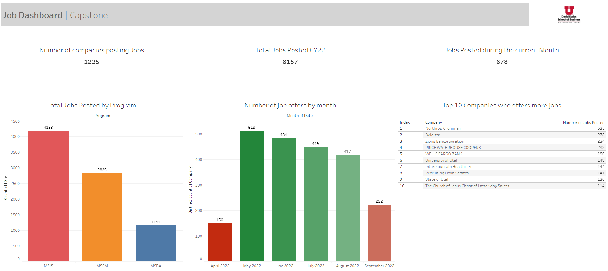

```{r warning=FALSE, message=FALSE}
library(tidyverse)
library(reticulate)
```


### The business problem for the project.

The Job Dashboard project aims for the MSIS, MSBA, and MSCM students at the University of Utah. The concept of this project is that the students in these specialized master's programs need top-notch access to information about the job market. Searching for jobs is very time-consuming to log on to various job search websites daily, and it tends to forget what attributes or skills students are looking for due to various information. 


### Analytic objective

This capstone project aims to modify and improve the job dashboard so that the students can find helpful information and reduce their time searching for potential jobs. Not only provides trends of skillsets and some analytics information such as topic modeling on job descriptions.

### Questions to guide your exploration.

* What skills are most wanted in the industry for data-related jobs?
* What skills are most sought by companies based on the study program of each student?
* Which companies are hiring for data-related jobs in the Salt Lake area?
* How many job offers are there in the market based on study program?
* How many years of experience does a company require to get a full-time job?
* Do companies sponsor international students with VISA/Greencard for jobs?
* What skills are most demanding related to the majors (MSBA/MSIS/MSCM)?


4. Data summaries based on your questions: plots (and more plots),  as well as summary tables.  If, as you are doing EDA, more questions occur to you, then go back and put them into your question list. Make sure  that you include titles, and in the case of plots, axis labels. Additionally, provide a brief interpretation of the plots and tables you have produced.





```{r}
df1 <- httr::GET("https://rstudio-connect.business.utah.edu/content/260/data") %>% 
    httr::content()
df1

df <- r_to_py(df1)
df
```


```{python}
import numpy as np
import pandas as pd
import spacy

import spacy
nlp = spacy.load("en_core_web_sm")

test_text = r.df['Description'].iloc[0]
text = test_text
doc = nlp(text)
tokenized = list(doc)
print(tokenized)
```

```{python}
stopwords = spacy.lang.en.stop_words.STOP_WORDS
text = test_text
doc = nlp(text)
filtered = []
for word in doc:
    if not word.is_stop:
        filtered.append(word)
r.df['Description'] = r.df['Description'].astype(str)
s = '-'
df_test = pd.DataFrame(r.df['Description'])
all_desc = s.join(df_test['Description'])
text = all_desc
doc = nlp(text)
print("="*40)
str_format = "{:>20}"*2
print(str_format.format('Text', 'NER'))
print("="*40)
for ent in doc.ents:
    print(str_format.format(ent.text, ent.label_))
```


5. Include a results section  at the end where you discuss what you have learned about your data and the relationships therein. Have you discovered any data problems? Do some relationships seem particularly strong? How has your EDA influenced your thinking about your analytics approach?

### Team member contribution