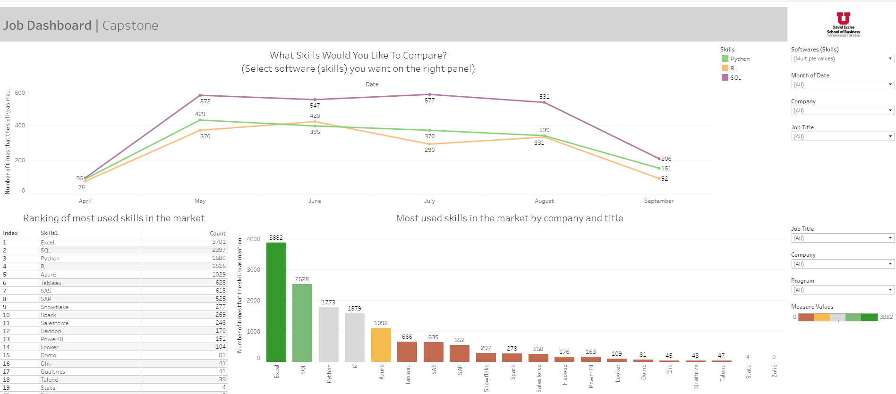
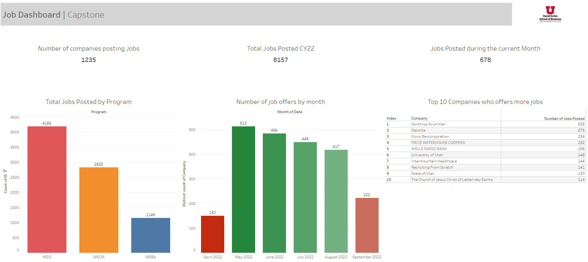

```{r warning=FALSE, message=FALSE}
library(tidyverse)
library(reticulate)
```


### The business problem for the project.

The Job Dashboard project aims for the MSIS, MSBA, and MSCM students at the University of Utah. The concept of this project is that the students in these specialized master's programs need top-notch access to information about the job market. Searching for jobs is very time-consuming to log on to various job search websites daily, and it tends to forget what attributes or skills students are looking for due to various information. 


### Analytic objective

This capstone project aims to modify and improve the job dashboard so that the students can find helpful information and reduce their time searching for potential jobs. Not only provides trends of skillsets and some analytics information such as topic modeling on job descriptions.

### Questions to guide your exploration.

* What skills are most wanted in the industry for data-related jobs?
* What skills are most sought by companies based on the study program of each student?
* Which companies are hiring for data-related jobs in the Salt Lake area?
* How many job offers are there in the market based on study program?
* How many years of experience does a company require to get a full-time job?
* Do companies sponsor international students with VISA/Greencard for jobs?
* What skills are most demanding related to the majors (MSBA/MSIS/MSCM)?


### Data summary



This dashboard page shows the most wanted skills for data-related jobs,



```{python}
# import numpy as np
# import pandas as pd
# import spacy
# 
# df = pd.read_csv('Indeed Jobs in Salt Lake City.csv')
# 
# test_text = df['Description'].iloc[0]
# 
# nlp = spacy.load('en_core_web_lg')
# text = test_text
# doc = nlp(text)
# tokenized = list(doc)
# print(tokenized)
```

```{python}
# stopwords = spacy.lang.en.stop_words.STOP_WORDS
# text = test_text
# doc = nlp(text)
# 
# filtered = []
# for word in doc:
#     if not word.is_stop:
#         filtered.append(word)
# 
# df['Description'] = df['Description'].astype(str)
# 
# s = '-'
# df_test = pd.DataFrame(df['Description'])
# all_desc = s.join(df_test['Description'])
# 
# nlp = spacy.load('en_core_web_lg')
# text = all_desc
# doc = nlp(text)
# 
# print("="*40)
# str_format = "{:>20}"*2
# print(str_format.format('Text', 'NER'))
# print("="*40)
# for ent in doc.ents:
#     print(str_format.format(ent.text, ent.label_))
```


### Results

We have learned that scraping the job's information from various websites is quite challenging. However, we will be focusing on the data we have currently and adding more data as we continue to scrape other job websites. We will work on the Topic Modeling and Named Entity Recognition (NER) Techniques, one of the fundamental processes in Natural Language Processing applications. This helps us easily identify the key elements in a text, like sponsorship, soft skills, hard skills, types of jobs,  technologies, and more. Extracting the main entities in a text helps sort unstructured data and detect important information, which is crucial for dealing with large datasets.

### Team member contribution


